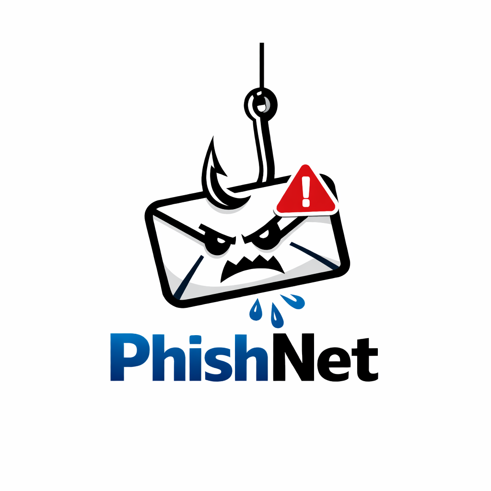

  

# PhishNet: AI Email Safety for Older Adults

**Team Members:** Arturo, Lillian, Jacob, Michael, Xavier
**Video Pitch (YouTube):** *Add link after recording*

## 1. Problem Statement
PhishNet comes from a real family problem: one team member’s grandmother often receives suspicious emails and cannot confidently tell whether they are real or fake. That hesitation is exactly what scammers exploit. Our main users are older adults and non-technical users who need a simple, trustworthy second opinion before clicking a link, opening an attachment, or replying.

This is a meaningful problem. In the FBI’s 2024 IC3 report, phishing/spoofing was the most reported complaint type with 193,407 complaints, and people over 60 reported the most complaints and the highest total losses overall.[1] The FTC also reported nearly $2.4 billion in reported fraud losses from people 60+ in 2024 and noted that scams targeting older adults are constantly changing and increasingly tailored.[2][3]

## 2. Why Now?
- Scam emails are getting more convincing, including AI-assisted fraud. The FBI said cyber-enabled fraud is being accelerated by AI, with more than 9,000 AI-related complaints reported to IC3 in the first seven months of 2025.[4]
- Current spam filters are mostly invisible; they block or allow messages, but rarely explain risk in plain language.
- Over the next 3–5 years, older adults will need tools that do not just filter messages, but actively teach them what looks suspicious and what to do next.

## 3. Proposed AI-Powered Solution
PhishNet is an email-checking assistant. A user pastes a suspicious email into the app, and the system returns:
- **Likely Safe**, **Suspicious**, or **Likely Phishing**
- a short plain-English explanation of the red flags
- highlighted warning signs such as urgency, impersonation, or requests for money / passwords
- a recommended safe next step

AI adds value because phishing is not just a keyword problem. Attackers constantly change wording, tone, and style. A rule-based system can catch obvious cases, but an AI model can better interpret language patterns and explain *why* the email looks risky.

## 4. Initial Technical Concept
We plan to build a text-based phishing detector using the subject line, sender text, email body, and a few lightweight features such as urgency terms and suspicious link patterns.

- **Baseline model:** TF-IDF + logistic regression
- **Main model:** compact transformer text classifier
- **Explanation layer:** structured templates, with optional LLM-generated summaries
- **nanoGPT connection:** use our nanoGPT work to study phishing-like language, generate synthetic examples, or support explanation generation

## 5. Scope for MVP
Our MVP is intentionally narrow and feasible:

> **A user can paste the text of a suspicious email, and our system returns a phishing risk label, a short explanation, and a recommended safe next step.**

A lightweight Streamlit or Gradio interface is realistic for this course.

## 6. Risks and Open Questions
1. Public datasets may not fully represent today’s AI-written phishing emails.  
2. False positives and false negatives matter because this is a trust-sensitive task.  
3. The explanation must be easy for older adults to understand, not just technically correct.

## 7. Planned Data Sources
- Enron Email Dataset for legitimate emails[5]
- Curated phishing email datasets on Zenodo spanning multiple sources[6]
- University of Twente phishing validation emails dataset for evaluation[7]
- Synthetic examples for controlled edge-case testing

## References
[1] [FBI IC3 2024 Annual Report](https://www.ic3.gov/AnnualReport/Reports/2024_IC3Report.pdf)  
[2] [FTC Protecting Older Consumers 2024-2025 Report](https://www.ftc.gov/system/files/ftc_gov/pdf/P144400-OlderAdultsReportDec2025.pdf)  
[3] [FTC Addressing Scams Affecting Older Adults](https://consumer.ftc.gov/features/addressing-scams-affecting-older-adults)  
[4] [FBI: Don’t Let Scammers Ruin Your Holiday Season](https://www.fbi.gov/news/press-releases/dont-let-scammers-ruin-your-holiday-season)  
[5] [CMU Enron Email Dataset](https://www.cs.cmu.edu/~enron/)  
[6] [Phishing Email Curated Datasets (Zenodo)](https://zenodo.org/records/8339691)  
[7] [University of Twente Phishing Validation Emails Dataset](https://research.utwente.nl/en/datasets/phishing-validation-emails-dataset/)
# MAE-301-Team-Project
